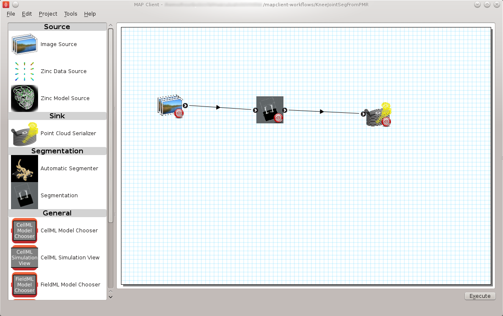
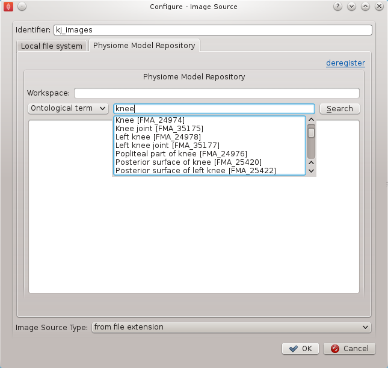
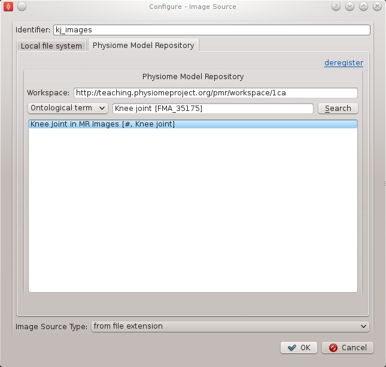
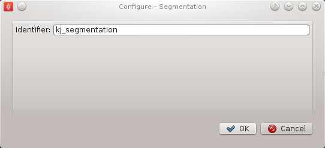
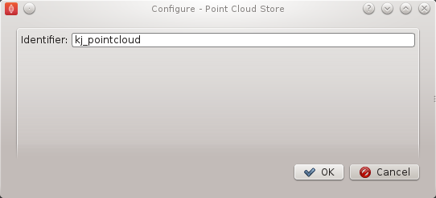
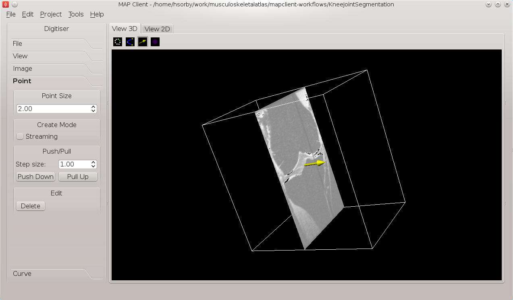
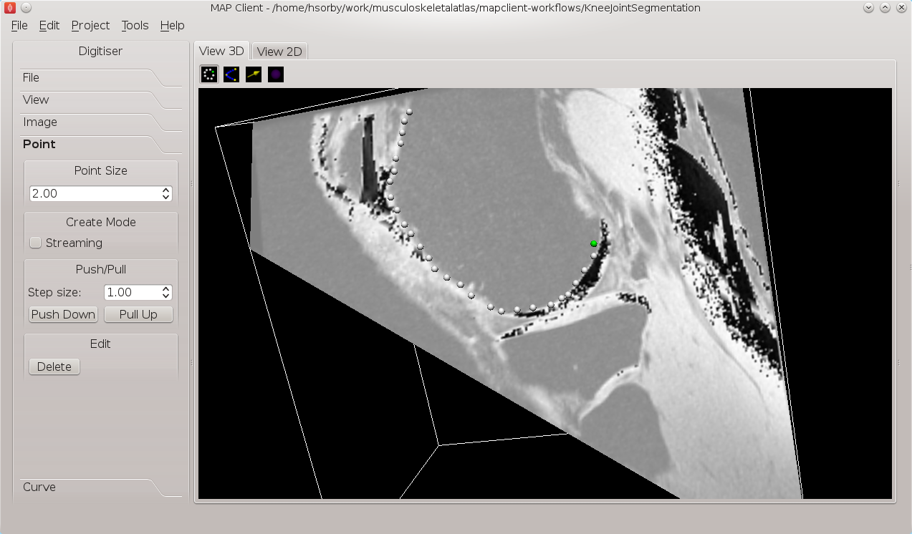
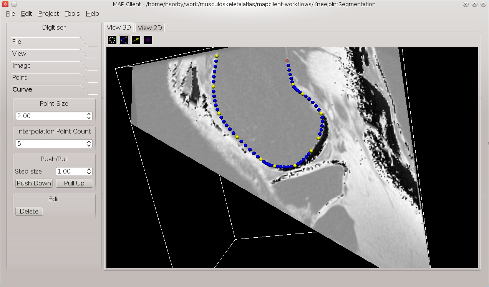
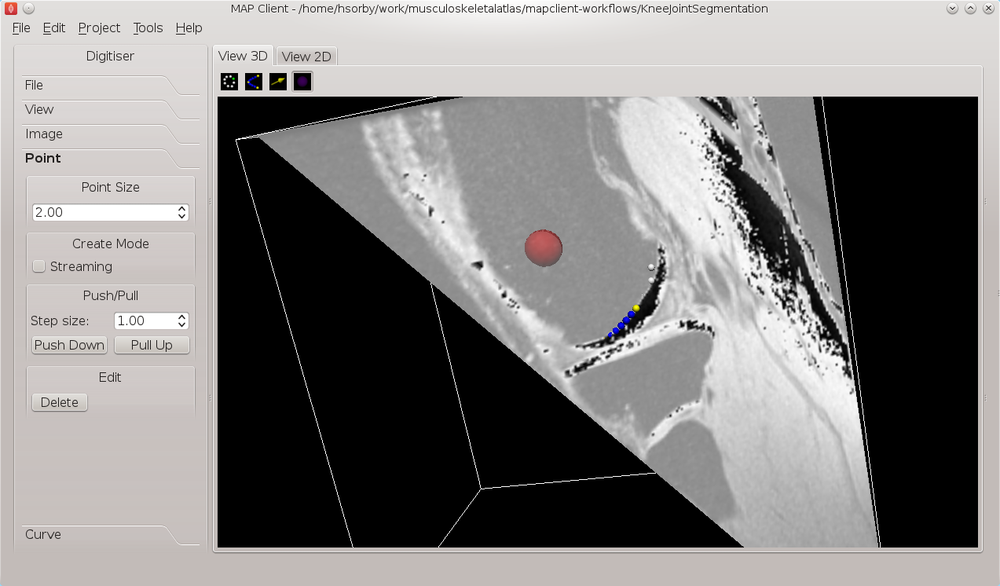

.. _mapclient-manualseg:

======================================================
Manual segmentation of a three-dimensional image stack
======================================================

The purpose of this task is to demonstrate the manual segmentation step that we are currently developing and to highlight the reusable nature of the steps.

Import Workflow from PMR
========================

Start the 'mapclient' application.  Use the 'File' menu to select the import action.  The dialog that appears connects to webservices on PMR that will enable us to search for MAP Client workflows.

.. figure:: images/importdialog_blank_1.png
   :width:  374 pt
   :figwidth: 374 pt
   :align: center

   **Figure 1**: Import Dialog [**1**] Workspace url, [**2**] Search text, [**3**] Search button, [**4**] Search results, [**5**] Destination directory, [**6**] Directory chooser button, [**7**] Confirm or cancel import.

We will leave the 'Search text' [**2**] blank and click the search button to search for all Workflows available on PMR.  Once the search results are displayed in [**4**] select the entry with the title 'Workflow: KneeJointSegmentation'.  This will put the Workspace url in the 'Workspace url' [**1**] box.  Next use the 'Directory chooser button' [**7**] to choose a local directory for importing the 'Workflow' to.  The chosen directory will be put in the 'Destination directory' [**5**].  When the 'Workflow url' and 'Directory destination' are correct press the 'Ok' button to complete the import.

Manual Segmentation of the Knee Joint Workflow
==============================================

The Manual Segmentation of the Knee Joint Workflow (MSKJW) consists of three workflow steps as shown in `MSKJW Figure 2`_.

.. _`MSKJW Figure 2`:

   
   **MSKJW Figure 2**: Manual Segmentation of the Knee Joint Workflow.
   
#. An image source step.

   This step is designed to pass the location of an image or images through to another step.  This step also has the functionality to download content from PMR.
   
#. A manual segmentation step.

   This step takes in the location of the image set and reads in the images using OpenCMISS-Zinc.    The output from this step is a list of point locations in the image space.

#. A point cloud serialization step.

   This step serializes a list of point locations to disk.

Before the workflow can be executed each step in the workflow must be configured and the workflow saved.  A gear icon in the bottom right hand corner of the step icon on the workflow canvas indicates whether the step is configured or not.  A red icon represents an unconfigured step whilst a green icon represents a configured step.  Clicking on the gear icon will display a configuration dialog for the step (if the step requires manual configuration).  When a step has been configured correctly the green icon will be displayed.  For our workflow we need to configure the image source step, the manual segmentation step and the point cloud serialization step.  A detailed discussion on configuring all the steps in this workflow is given below.

Workflow Configuration
----------------------

This section describes how each step should be configured.  

Image Source Step
^^^^^^^^^^^^^^^^^

The image source step requires a unique identifier for the step to be set.  It also requires either a location on the local disk where the image data is located or a PMR workspace url from which the image data may be downloaded.

This step configuration makes use of the PMR search widget which gives us the ability to search available workspaces on PMR.  We will make use of this functionality in this example.  In the image source step configuration dialog seen in `MSKJW Figure 3`_ we can see that there is a place to set a unique identifier for the step and also two tabs, one tab is for setting the image dataset location on the local disk and the other tab is for searching PMR workspaces for image data.  We will leave the local disk edit box on the local file system tab empty and allow the configuration to set the default location.

..  _`MSKJW Figure 3`:

.. figure:: images/imagesource_configureblank.png
   :align: center
   :width: 30%
   
   **MSKJW Figure 3**: Image source step configuration dialog.

Set the identifer edit box to kj_images and select the Physiome Model Repository tab so that we can search PMR for our images.  On this tab (`MSKJW Figure 4`_) we see a number of graphical elements.  We have an edit box [**1**] for entering a url that references a workflow on PMR, a combobox [**2**] that sets the type of search we wish to perform, a search term edit box [**3**] for entering our search string, a search button [**4**] to execute the search on PMR and a results list [**5**] where a list of results will be shown when the search completes.

We are going to conduct an ontological term search for our images, we are looking for some images that show the knee joint.  To do this we can start entering the text knee joint into the search term edit box [**3**], when we pause in our typing the dialog will query the PMR OWL terms for suitable matches.  We will see results similar to what is shown in `MSKJW Figure 5`_, we can click on the matching term in this list and the correct reference will be added to the search term edit box [**3**] for us.

.. _MSKJW Figure 4:

.. figure:: images/imagesource_configurepmr.png
   :align: center
   :width: 40%
   
   **MSKJW Figure 4**: PMR search tab, [**1**] Workspace url, [**2**] Search type combobox, [**3**] Search term, [**4**] Search button, [**5**] Search results.

.. _`MSKJW Figure 5`:

   
   **MSKJW Figure 5**: PMR OWL terms.

With the correct term in place we can click the search button to return matching results from PMR.  We will get back a single result Knee Joint in MR Images.  When we select this result in the search results list [**5**] the url for the workspace will be loaded into the workspace url edit box [**1**].  We should now have the dialog looking similar to `MSKJW Figure 6`_.

.. _`MSKJW Figure 6`:

   
   **MSKJW Figure 6**: Completed Physiome Model Repository search tab.

This completes the configuration of the image source step.  When we click Ok in the dialog the images will be downloaded to the default directory on our local disk.

We can also use the combobox at the bottom of the dialog (`MSKJW Figure 3`_) to set the image type however this is only necessary if the image type cannot be determined through the filename extension.  In our case we can leave this as it is.

Alternatively, if PMR is unavailable copy the images from a usb memory stick into a directory on your computer, set the location on the local file system tab to this directory.

Segmentation Step
^^^^^^^^^^^^^^^^^

The segmentation step only requires the identifier for the step to be specified. The identifier will also be used to create an output directory of the same name and the serialization of the input data will be placed into a file under this directory.  Set the identifier to 'kj_segmentation' (as in `MSKJW Figure 7`_).

.. _`MSKJW Figure 7`:

   
   **MSKJW Figure 7**: Point cloud configuration dialog.
   

Point Cloud Serialization Step
^^^^^^^^^^^^^^^^^^^^^^^^^^^^^^

The point cloud serialization step only requires the identifier for the step to be specified.  The identifier will also be used to create an output directory of the same name and the serialization of the input data will be placed into a file under this directory.  Set the identifier to 'kj_point_cloud' (as in `MSKJW Figure 8`_).

.. _`MSKJW Figure 8`:

   
   **MSKJW Figure 8**: Point cloud configuration dialog.
   
Execute the Workflow
====================

Once all the workflow steps have been correctly configured save the workspace.  We can do this through the File menu and selecting the save entry or by using the keyboard shortcut 'ctrl+s'.  Because we have a workflow based on a version control system the commit dialog will appear so that we can keep a record of the changes.  `MSKJW Figure 9`_ shows this dialog, here we want to choose the skip commit option to save our workflow.  In this example we are not going to commit our changes back to the workspace on PMR.

.. _`MSKJW Figure 9`:

.. figure:: images/pmr_commit_workspace.png
   :align: center
   :width: 40%
   
   **MSKJW Figure 9**: PMR workspace commit dialog.
   
At this point we are ready to begin executing the workflow.  To do this we click the execute button in the lower right hand corner of the window.

Execution
=========

Once the execute button has been clicked the workflow will start to traverse the underlying directed graph, in our case starting from the image source step.  In this simple workflow the only interactive step is the segmentation step which displays a visualisation of the images to assist segmentation.

Segmentation
============

The segmentation step is a tool to assist the user digitise a set of images.  It offers a number of tools to assist the user in digitising their images including a novel feature that allows the digitising plane to be oriented into an arbitrary orientation thus allowing the user to choose the best view of the image's features as possible.  For information on how to use the tools in the segmentation step read the documentation available from the :ref:`segmentation-tool-user`.

In this task we want to digitise the distal femur.  To do this we will first need to use the normal tool to move the image plane up the image stack until we see the distal femur (`MSKJW Figure 10`_).  

.. _`MSKJW Figure 10`:

   
   **MSKJW Figure 10**: Segmentation tool with the image plane moved upwards to show the distal femur.
   
The normal tool can be activated using the tab toolbar.  When activated the normal for the plane will be indicated with a yellow arrow.  Use the left mouse button to click on the arrow and with the left mouse button held down drag the plane to the desired location.  When clicked the arrow will change colour to orange to indicate that it has been selected.

Change to the point tool to create some segmentation points.  Segmentation points can be added by holding down the Ctrl key whilst pressing the left mouse button.  The toolbox for the point tool has some options to change the behaviour of the tool, the streaming create option is a quick way to add a series of segmentation points for users with good mouse control.

.. _`MSKJW Figure 11`:

   
   **MSKJW Figure 11**: Segmenting the distal femur using segmentation points.

For mapping out curved features the curve tool reduces the number mouse clicks required by adding in interpolated Bezier points between the control points.  Use Ctrl and the left mouse button to place control points and Ctrl and the right mouse button to finish.

.. _`MSKJW Figure 12`:

   
   **MSKJW Figure 12**: Segmenting the distal femur using the curve tool.

If the femur edges are hard to determine a change in plane orientation may be required for this purpose we have the orientation tool.  To use the orientation tool click on it in the tabs toolbar, when using the orientation tool the image plane itself can be oriented using the left mouse button.  The centre of rotation for the plane is the purple sphere, if you want to change the point of rotation use the left mouse button and click on the sphere.  While the mouse button is held down the sphere will follow the mouse movements.  Release the mouse and the plane can now be rotated around the new rotation point.  When clicked the sphere will change colour to red to indicate that it has been selected.

.. _`MSKJW Figure 13`:

   
   **MSKJW Figure 13**: Moving the centre of rotation when using the orientation tool.

All the segmentation points (except blue interpolated Bezier points) can be selected and moved by pressing the Ctrl key and using the left mouse button to click on them.  You can also press the shift key and using the left mouse button select multiple segmentation points.  You can only select segmentation points for the tool that is currently in operation.

A feature to try out is the push/pull feature of moving a group of segmentation points a set distance in the direction of the plane normal.  This is useful when segmenting features that don't vary much over small distances such as the shaft of a femur.

Feel free to experiment as the segmentation step has full undo/redo capabilities.

We can also load a previous session or save the current one.  On the USB sticks there is a sample segmentation of the distal femur available, put this file into the kj_segmentation directory.  With the File toolbox open click the load button, the saved session will be loaded into the current session.
All previous work will be lost so if you want to keep it first save your current session before loading the sample file.  Rename the saved file and then you are free to setup the sample segmentation.

Check Output
============

We can now examine the output of the workflow using any text editor.  The output is stored in a file called point_cloud.txt in a directory kj_point_cloud which can be found under the workflow directory.

.. todo::

#. Explain how those two output steps are identical to those from the previous task and talk about step-reuse, sharing knowledge, reproducibility, etc.
